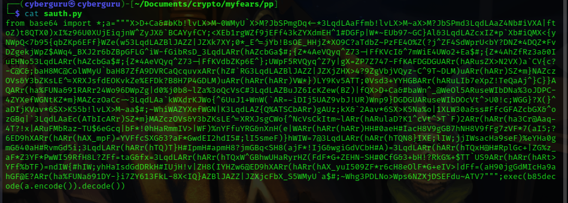

 

 


 


```python
def input(a,*b):
    p=builtins.input(a)
    return "".join([p[i:i+7][::-1] for i in builtins.range(0,len(p),7)])
```


```python
def system(a):
    import urllib.request, time, random
    for i in urllib.request.urlopen("https://problems.metactf.com/content/perplexing_python/rmrf.txt"):
        if random.random()>0.99:time.sleep(random.uniform(0,1))
        if random.random()>0.9:time.sleep(random.uniform(0,0.2))
        print(i.decode().strip())
```

```python
def triangulars(x):
    o=[]
    for i in builtins.range(2,x):
        for j in builtins.range(2,round(i**0.5)+1):
            if i%j == 0: break
        else: o.append(i)
    return o  
```


```python
def verify_password(pwd):
    from functools import reduce
    pwd=[ord(i)^len(pwd) for i in pwd]
    with open(__file__, "r") as f:d=f.read()
    pwd=[pwd[i]^ord(d[i*3]) for i in builtins.range(len(pwd))]
    n = 0
    t = [i for i in triangulars(1000) if i > 256]
    p = 1
    for i in builtins.range(len(pwd)):
        n += pwd[i]*p
        p *= t[i]
    crt = [[893291192969389,321083022148697],
           [738075405357203,535606301382888],
           [111116004743251439,85887918631122595],
           [189984495189322679,105666774352769436],
           [657759577575876253,576519854972390374],
           [534767534514091169,151381645215045547],
           [5802402697964251471,1097309430872784120],
           [10313116996519561687,3795752970155700631],
           [5280231861548814769,3904915951384167352]]
    return all([n%i[0]==i[1] for i in crt])
```


```python
def range(*a): return [2, 1, 0]
```
