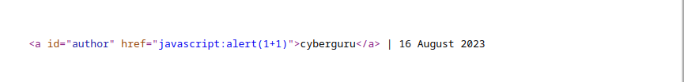
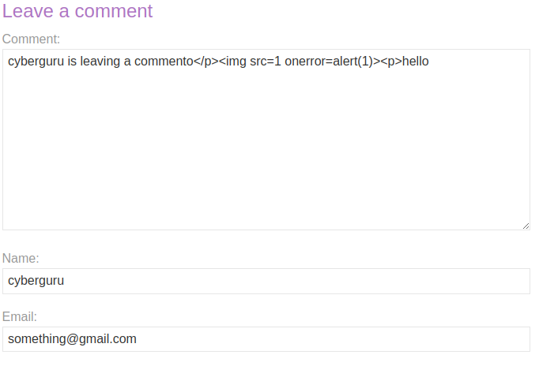

# Portswiger XSS

# Lab: [Reflected XSS](https://portswigger.net/web-security/cross-site-scripting/reflected) into HTML context with nothing encoded

This lab contains a simple [reflected cross-site scripting](https://portswigger.net/web-security/cross-site-scripting/reflected) vulnerability in the search functionality.

To solve the lab, perform a cross-site scripting attack that calls the `alert` function.

Navigating to the website we got this blog


we then try crafting our payload into the search bar and clicked on search


and we got this:


or alternatively:

we could use the print statement to print out the page using the following payload

```javascript
<script>print(1)</script>
```


# Lab: [Stored XSS](https://portswigger.net/web-security/cross-site-scripting/stored) into HTML context with nothing encoded

This lab contains a [stored cross-site scripting](https://portswigger.net/web-security/cross-site-scripting/stored) vulnerability in the comment functionality.

To solve this lab, submit a comment that calls the `alert` function when the blog post is viewed.

after accessing the lab we try crafting a payload in the comment section using the following payload:

```javascript
<script>alert(1)</script>
```


submitting the paload we get:


# Lab: [DOM XSS](https://portswigger.net/web-security/cross-site-scripting/dom-based) in `document.write` sink using source `location.search`

This lab contains a [DOM-based cross-site scripting](https://portswigger.net/web-security/cross-site-scripting/dom-based) vulnerability in the search query tracking functionality. It uses the JavaScript `document.write` function, which writes data out to the page. The `document.write` function is called with data from `location.search`, which you can control using the website URL.

To solve this lab, perform a [cross-site scripting](https://portswigger.net/web-security/cross-site-scripting) attack that calls the `alert` function.

entering the site and searching for a string we notice that the site embedds our search string into an image tag using the document.write and location.search attribute;


we could see in the script tag that once a query exist from the if condition content is passed to the `trackSearch` function which simply uses the `document.write` function to write an `img tag` of a new image with our query in it

knowing this we could inject an svg payload into it that load the content of the svg payload; doing some googling we got this svg injection script for svg:

```html
<svg onload=alert(1)>
```

before injecting the payload we need to escape the current string by using a double quote before the payload, so it becomes:

```html
"<svg onload=alert(1)>
```

injecting this as our payload solves the lab:


# Lab: [DOM XSS](https://portswigger.net/web-security/cross-site-scripting/dom-based) in `innerHTML` sink using source `location.search`

This lab contains a [DOM-based cross-site scripting](https://portswigger.net/web-security/cross-site-scripting/dom-based) vulnerability in the search blog functionality. It uses an `innerHTML` assignment, which changes the HTML contents of a `div` element, using data from `location.search`.

To solve this lab, perform a [cross-site scripting](https://portswigger.net/web-security/cross-site-scripting) attack that calls the `alert` function.

We access the given blog site and try searching for a random string, we now enter the inspect the source code and try finding the string we inserted:


Next task is to check for input sanitization, we do that by putting a less than tag in our search query:


as we could see in the search query there is not input validation as we have putting the search string `<>cyberguru` and it reflected without escaping

next phase is to insert our payload; we decide to use the simple img tag payload:

```html

```

we inject this payload into our search query and send:


we got the pop up cyberguru and the lab is succesfully solved.


# Lab: [DOM XSS](https://portswigger.net/web-security/cross-site-scripting/dom-based) in jQuery anchor `href` attribute sink using `location.search` source

This lab contains a [DOM-based cross-site scripting](https://portswigger.net/web-security/cross-site-scripting/dom-based) vulnerability in the submit feedback page. It uses the jQuery library's `$` selector function to find an anchor element, and changes its `href` attribute using data from `location.search`.

To solve this lab, make the "back" link alert `document.cookie`.

we navigate to the given blog using the provided link, we clicked on the submit feedback and filled in a random value for each parameters, after doing that we change the return path  that links to the back button from the original one to our injected one

original value:

```html
https://0ab7002d03e2b0b080183fd30072006a.web-security-academy.net/feedback?returnPath=/post
```

Changed to:

```html
https://0ab7002d03e2b0b080183fd30072006a.web-security-academy.net/feedback?returnPath=javascript:alert(document)
```

as you must have noticed we simply changed the returnPath from /post to javascript:alert(document.cookie)

submitting this injected payload we get the following response:


# Lab: [DOM XSS](https://portswigger.net/web-security/cross-site-scripting/dom-based) in jQuery selector sink using a hashchange event

This lab contains a [DOM-based cross-site scripting](https://portswigger.net/web-security/cross-site-scripting/dom-based) vulnerability on the home page. It uses jQuery's `$()` selector function to auto-scroll to a given post, whose title is passed via the `location.hash` property.

To solve the lab, deliver an exploit to the victim that calls the `print()` function in their browser.

After accessing the blog site from the provided link, we view the source page and saw the following content in the home page:


this is a jquery code embedded in a script tag; what this code does is to detect a change in the hash of each blogpost accoriding to their postid and scroll into view of that particular post, the hash is usually find after the "#" content after the link url

The exploit we are going to perform is quite the unique one, we are going to use the iframe tag to embedd our payload and send it to the victim :

```html
<iframe src="https://0ab9001c047b10b680a07bd000fe0078.web-security-academy.net/#" onload="this.src+=''">
```

What the payload simply does is to add our malicious code at the end of the "#" to serve as our hash content so that the jquery can now process our injected input all without the users interaction.

we then send this crafted payload to burpsuite exploit server to help us run the payload and we got the following result after submitting:


# Lab: [Reflected XSS](https://portswigger.net/web-security/cross-site-scripting/reflected) into attribute with angle brackets HTML-encoded

This lab contains a [reflected cross-site scripting](https://portswigger.net/web-security/cross-site-scripting/reflected)  vulnerability in the search blog functionality where angle brackets are  HTML-encoded.

To solve this lab, perform a cross-site scripting attack that injects an attribute and calls the `alert` function.

As the name of the lab suggest, all our input in the blog search fields are encoded using HTML-encoding before being reflected back to the user so to solve this lab we use the event handler class to trigger an XSS when a user performs a certain action we did this by escaping the double quotes and assigning a variable to the event change class in the input tag

Payload used:

```html
"onmousemove="alert(12)
```

what this payload simply does is to alert 12 when the user moves ontop of the input field of the search bar.

After sending the above payload we got this:


# Lab: [Stored XSS](https://portswigger.net/web-security/cross-site-scripting/stored) into anchor `href` attribute with double quotes HTML-encoded

This lab contains a [stored cross-site scripting](https://portswigger.net/web-security/cross-site-scripting/stored) vulnerability in the comment functionality. To solve this lab, submit a comment that calls the `alert` function when the comment author name is clicked.


First off, we access the lab and view the first post, in this post there is a comment section at the bottom of the page, we fill in the following into the comment section


as we could see in the website entry the following payload was inserted:

```html
javascript:alert(1+1)
```

this payload executes the alert an pops up 2 when runned in the url field

we then submit this the comment, after submitting it we click on the user name and see the following result:

 

what's really happenning ?

To answer this we view page source and we saw that our payload in the website entry was attached to the a tag href field so anytime the username is clicked the payload executes: 




this challenge is a good description of a stored xss attack.


# Lab: [Reflected XSS](https://portswigger.net/web-security/cross-site-scripting/reflected) into a JavaScript string with angle brackets HTML encoded

This lab contains a [reflected cross-site scripting](https://portswigger.net/web-security/cross-site-scripting/reflected) vulnerability in the search query tracking functionality where angle brackets are encoded. The reflection occurs inside a JavaScript string.

To solve this lab, perform a cross-site scripting attack that breaks out of the JavaScript string and calls the `alert` function.


As usuall we access the lab and enter a search query into the search bar, after we send the search query string we open the inspect menu and saw that our search string get inserted here:

```html
<script>
    var searchTerms = 'cyberguru';
   document.write('');
</script>
```

our search string is "cyberguru" which as we saw in the above snippet code is assigned to a variable called `searchTerms ` , our next goal is to find a way to escape the assignment operator and inject our payload into the script tag envrioment

this the payload that was crafted:

```javascript
';alert(7+7);searchTerms='
```

we send the payload and got this:

 


# Lab: [DOM XSS](https://portswigger.net/web-security/cross-site-scripting/dom-based) in `document.write` sink using source `location.search` inside a select element

This lab contains a [DOM-based cross-site scripting](https://portswigger.net/web-security/cross-site-scripting/dom-based) vulnerability in the stock checker functionality. It uses the JavaScript `document.write` function, which writes data out to the page. The `document.write` function is called with data from `location.search` which you can control using the website URL. The data is enclosed within a select element.

To solve this lab, perform a [cross-site scripting](https://portswigger.net/web-security/cross-site-scripting) attack that breaks out of the select element and calls the `alert` function.


# Lab: [DOM XSS](https://portswigger.net/web-security/cross-site-scripting/dom-based) in AngularJS expression with angle brackets and double quotes HTML-encoded

This lab contains a [DOM-based cross-site scripting](https://portswigger.net/web-security/cross-site-scripting/dom-based) vulnerability in a [AngularJS](https://portswigger.net/web-security/cross-site-scripting/contexts/client-side-template-injection) expression within the search functionality.

AngularJS is a popular JavaScript library, which scans the contents of HTML nodes containing the `ng-app`attribute (also known as an AngularJS directive). When a directive is added to the HTML code, you can execute JavaScript expressions within  double curly braces. This technique is useful when angle brackets are being encoded.

To solve this lab, perform a [cross-site scripting](https://portswigger.net/web-security/cross-site-scripting) attack that executes an AngularJS expression and calls the `alert` function.


In this Lab our main aim is to take advantage of the "ng-app" attribute that angularjs provide  to inject our script, angularjs searches the HTML tags for any attribute named "ng-app" and executes whatever is stored in a double curly braces, we could use this feature to pass in our payload.

we first of all escape the search string and pass in our extra attribute called "ng-app" into the html tag

below is the payload used for this lab:

```html
' ng-app="{{constructor.constructor('alert(7+7)')()}}" d='
```

we submit this payload as the query and got this:


# Lab: Reflected [DOM XSS](https://portswigger.net/web-security/cross-site-scripting/dom-based)

This lab demonstrates a reflected DOM vulnerability. Reflected DOM vulnerabilities occur when the server-side application processes data from a request and echoes the data in the response. A script on the page then processes the reflected data in an unsafe way, ultimately writing it to a dangerous sink.

To solve this lab, create an injection that calls the `alert()` function.


This lab talks about server-side xss, that is the server process our payload and returns it without proper validation; the main aim of this lab is to escape the json assignment operator and attach our injection payload which the server would execute and return back the result; the two things we need to solve this lab is the sitemap and intruder or repeater in Burpsuite

Accessing the lab, we have a search button where we could inject our payload to we start by experimenting how our payload is passed to the server in the searchObject field, checking the source code we saw a js file  called search-results.js in the file we saw that eval is called on our input search string:


in the sitemap we saw how our input is passed as a json object to the search-results.js file

below is an image of the json object:

 

The above image shows how our search query string "cyberguru" is assigned to searchTerm in the json object.

Our main goal is to bypass the searchTerm assignment and input our payload

we used the following payload to archieve our goal:

```html
\"+alert(7+7)}//"
```

Explanation of the payload:

The payload starts with a backward slash to escape the double quote, this double quote is used to close the searchTerm assignment like this:

```javascript
searchTerm = "\\"+
```

after the searchTerm assignment is escaped we then include a add operator which appends our payload and give space immediately after the searchTerm is closed, then we have the main injection payload which is the `alert(7+7)` what follows it is a closing braces used to close the json early, then the last two forward slashes is used to comment out everything that is supposed to be after searchTerm 😄 this payload is quite funny and also confusing 😕

we send this payload and got the following result:

 


And this conclude our solution

 


# Lab: Stored [DOM XSS](https://portswigger.net/web-security/cross-site-scripting/dom-based)

This lab demonstrates a stored DOM vulnerability in the blog comment functionality. To solve this lab, exploit this vulnerability to call the `alert()` function.


This lab is simillar to the previous one only that is stored, we access the lab and went to the comment section of one of the post we fill in the comment section with the following:

 


my main goal is to escape the pharagrap tag `<p>` by closing it early then inject our payload into it. The payload used for the lab is as below:

```html

</p>
```

we send the payload and got the following response:


 


# Lab: [Reflected XSS](https://portswigger.net/web-security/cross-site-scripting/reflected) into HTML context with most tags and attributes blocked

This lab contains a [reflected XSS](https://portswigger.net/web-security/cross-site-scripting/reflected) vulnerability in the search functionality but uses a web application firewall (WAF) to protect against common XSS vectors.

To solve the lab, perform a [cross-site scripting](https://portswigger.net/web-security/cross-site-scripting) attack that bypasses the WAF and calls the `print()` function.

#### Note

Your solution must not require any user interaction. Manually causing `print()` to be called in your own browser will not solve the lab.


 


 


# Lab: [Reflected XSS](https://portswigger.net/web-security/cross-site-scripting/reflected) into HTML context with all tags blocked except custom ones

This lab blocks all HTML tags except custom ones.

To solve the lab, perform a [cross-site scripting](https://portswigger.net/web-security/cross-site-scripting) attack that injects a custom tag and automatically alerts `document.cookie`.


# Lab: [Reflected XSS](https://portswigger.net/web-security/cross-site-scripting/reflected) with some SVG markup allowed

This lab has a simple [reflected XSS](https://portswigger.net/web-security/cross-site-scripting/reflected) vulnerability. The site is blocking common tags but misses some SVG tags and events.

To solve the lab, perform a [cross-site scripting](https://portswigger.net/web-security/cross-site-scripting) attack that calls the `alert()` function.
